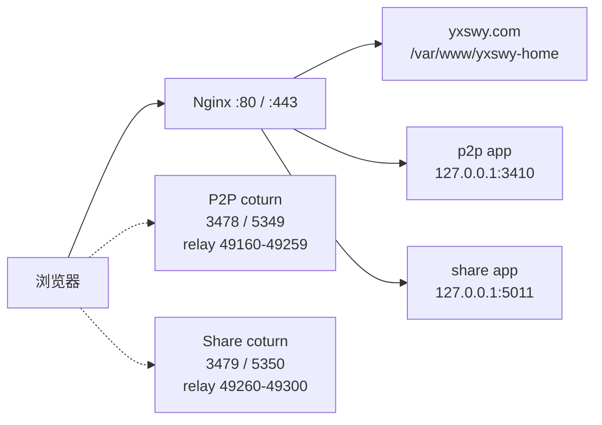

# Yxswy 部署与运维手册

> 适用范围：`yxswy.com` 根站点、`p2p.yxswy.com` P2P Transmission、`share.yxswy.com` WebRTC Camera Share。<br>
> 文档更新时间：2026-07-23，适用于当前腾讯云单机部署。<br>
> P2P 最新线上验收：2026-07-23 16:33（Asia/Shanghai）；根站点和 Camera Share 的状态仍需按各自章节及服务器现场核对。<br>
> 安全原则：本文不保存密码、Token、TURN shared secret、证书私钥、SSH 私钥或 `.env` 内容。

> 维护规则：本手册同时保存“当前线上快照”和“历史发布记录”。发布完成后只更新快照、最新发布证据和待办，不改写历史记录；如果本文与服务器现场、不可变镜像 digest 或公网验收结果冲突，以后者为准，并在本文补录差异。

## 0. 快速入口

| 目标 | 首先阅读 | 正式变更入口 |
| --- | --- | --- |
| 根站点静态页面 | 第 4 节 | `R:\yxswy-home` 手工原子发布 |
| P2P Transmission | 第 5 节及 `R:\p2p-transmission\docs\deployment.md` | GitHub `main` 的 `Production` workflow |
| WebRTC Camera Share | 第 6 节及 `R:\webrtc-camera-share\docs\DEPLOYMENT.md` | 现场 Compose/镜像流程，先核对服务器实际配置 |
| 线上异常 | 第 10 节 | 先判断“可回滚 / 需修复 / 需停发”，不要直接重启全机 |

### 0.1 三条执行规则

1. 先确认变更对象和当前线上版本，再执行备份、构建和切换；不要把“本地能打开”当作发布成功。
2. P2P 的正式发布必须经过 PR、`main`、Production workflow 和公网 WSS/TURN 验收；不能直接在服务器上替换容器。
3. 如果另一个会话正在维护 favicon/ICO 或其他构建资源，先查看 `git status`、`git diff --name-status` 和文件 SHA-256；不得用清理命令、旧构建产物或整目录覆盖删除并行修改。

### 使用约定

- 本手册分为“当前线上快照”和“可重复操作流程”两类内容。快照用于判断现状，流程用于执行变更；两者不一致时，以服务器现场、镜像 digest 和公网验收结果为准。
- 命令中的 `<TAG>`、`<STAMP>`、`<PREVIOUS_TAG>` 等是占位符，执行前必须替换；任何 secret、完整 `.env` 或私钥都不能粘贴进命令记录。
- Windows 工作站优先使用 `python -X utf8` 调用 `ssh`、`scp` 和 HTTP 探针，减少 PowerShell 多层引号和中文编码造成的误判。远端 Linux 命令只在已核验主机上执行。
- 正式发布默认从干净 commit 构建。紧急热修复若暂时必须使用脏工作树，必须记录完整 diff、通过同等门禁，并在部署后立即 commit/push，直到完成前不得把该版本当作可长期回滚制品。

## 1. 当前线上状态

本节是 2026-07-23 从公网和服务器现场核对得到的快照，和仓库中的历史发布记录分开维护。

| 入口 | 当前状态 | 线上边界 |
| --- | --- | --- |
| `https://yxswy.com/` | HTTP 200 | Nginx 静态站点，根目录 `/var/www/yxswy-home` |
| `https://www.yxswy.com/` | 规范化到 `https://yxswy.com/` | www 不单独提供内容 |
| `https://p2p.yxswy.com/` | HTTP 200 | Nginx 反代到 `127.0.0.1:3410` |
| `https://share.yxswy.com/` | HTTP 200 | Nginx 反代到 `127.0.0.1:5011` |
| `turn.p2p.yxswy.com` | HTTP 访问返回 404 | 这是 TURN 域名，不是网页；TURN 使用 3478/5349 协议端口 |
| `excuse.yxswy.com`、`super.yxswy.com` | 不属于当前发布目标 | 已按产品要求移除，不要重新接入首页或 Nginx |

当前服务器核对结果：

- 腾讯云主机：`101.35.246.159`；主机名：`VM-0-3-opencloudos`。
- Nginx 对外监听 TCP `80/443`。
- 根站点当前 `index.html` SHA-256：`d45a13a1a8b6524c22edd06d82b9baf4941d1c5bb3f37d92fa0b64d46ce1f509`。
- P2P 当前容器镜像：`p2p-transmission:2.0.1-b8eac83`，对应合并提交 `b8eac83c09bc7601a3e89a8986631660540b2d54`。
- Camera Share 当前容器镜像：`webrtc-camera-share:ui-20260723-02`。
- Camera Share 最近一次静态资源修复已验证：`/favicon.ico` 返回 `200 image/x-icon`，`/favicon.svg` 返回 `200 image/svg+xml`，PNG 图标返回 `200 image/png`；若再次返回 `text/html`，说明请求命中了 SPA 回退或线上仍是旧镜像。
- 两个项目的 coturn 都使用 `host` 网络模式；普通网页 HTTP 200 不能代替 TURN 验收。
- 根站点最近发布后，Nginx `nginx -t` 已通过；静态文件更新不需要 reload Nginx。

P2P 本轮线上快照（2026-07-23）：

- PR：<https://github.com/puzzle-fuzzy/p2p-transmission/pull/3>，已合并到 `main`。
- Production workflow：<https://github.com/puzzle-fuzzy/p2p-transmission/actions/runs/29989439171>，构建、native/WASM、完整浏览器 E2E、容器、部署、WSS/WebRTC、TURN relay 和 finalize 均成功。
- `/health/ready` 返回 HTTP 200，`status=ready`，release 为 `2.0.1-b8eac83`。
- 公网 `/favicon.ico` 返回 `200 image/x-icon`，8931 bytes；线上 SHA-256 与 `R:\p2p-transmission\rust\apps\web\public\favicon.ico` 一致。
- 后续发布不得继续使用 `2.0.1-a9bcb96` 作为当前版本描述；它只保留在历史发布记录中。

## 2. 部署拓扑



### 2.1 本地项目与线上目录

| 项目 | 本地源码 | GitHub | 线上目录/运行方式 |
| --- | --- | --- | --- |
| 根站点 | `R:\yxswy-home` | `https://github.com/puzzle-fuzzy/yxswy-home` | `/var/www/yxswy-home`，静态文件 |
| P2P | `R:\p2p-transmission` | 该项目现有 GitHub 仓库 | `/opt/p2p-transmission`，Rust 容器 + SQLite |
| Camera Share | `R:\webrtc-camera-share` | 该项目现有 GitHub 仓库 | `/opt/webrtc-camera-share`，Rust 应用 + coturn |

服务器上还有其他业务容器，例如 `desklink-relay`、`lunar-oracle-postgres`、`mihomo`、`headscale`。部署或回滚 Yxswy 项目时，不得执行全局 Docker 重启、`docker system prune` 或删除未知目录。

## 3. 域名与 Nginx

### 3.1 根站点

配置模板：`R:\yxswy-home\deploy\nginx\yxswy.com.conf.example`

- HTTP `yxswy.com`、`www.yxswy.com`：保留 ACME challenge，其余跳转 HTTPS。
- HTTPS `www.yxswy.com`：301 到 `https://yxswy.com$request_uri`。
- HTTPS `yxswy.com`：`root /var/www/yxswy-home`，入口为 `index.html`。
- 安全响应头包括 `nosniff`、`Referrer-Policy`、`Permissions-Policy` 和 CSP。
- `/robots.txt`、`/sitemap.xml`、`favicon.svg`、`favicon.ico` 与 `index.html` 一起发布。

### 3.2 P2P

配置源：`R:\p2p-transmission\deploy\production\nginx\p2p.yxswy.com.conf`

- HTTP 自动跳转 HTTPS。
- `p2p.yxswy.com` 的应用和 WebSocket 反代到 `127.0.0.1:3410`。
- `/assets/` 使用长期 immutable 缓存；应用 WebSocket 保留 Upgrade 头和长超时。
- `/internal/metrics` 对公网固定返回 404。
- `turn.p2p.yxswy.com` 的 HTTP 路由返回 404 是预期行为，不要把它改成网页站点。

### 3.3 Camera Share

线上现场当前为 Nginx HTTPS 入口，应用反代到 `127.0.0.1:5011`。仓库内可复用的标准配置和生产说明仍以 `R:\webrtc-camera-share\docs\DEPLOYMENT.md`、`deploy\caddy`、`deploy\coturn` 和 Compose 模板为准；实际切换时以服务器上的 Nginx/Caddy 现状和 `.env` 为最终依据。

## 4. 根站点发布流程

根站点是静态 HTML，当前采用 Windows 工作站通过 SSH/SCP 手工发布。发布只替换目标文件，不触碰两个应用容器。

### 4.1 发布前检查

1. 确认工作目录为 `R:\yxswy-home`。
2. 检查 `git status -sb` 和 `git diff --check`。
3. 用浏览器或 Chromium 检查至少 `390px`、`1920px`、`2560px` 三种视口。
4. 确认只需要发布的文件；单文件排版修改只发布 `index.html`。
5. 不把 `.env`、SSH 私钥、证书或临时测试输出放进站点目录。

### 4.2 安全发布顺序

下面是服务器侧的顺序。`<STAMP>` 使用 UTC 时间戳，`<LOCAL_FILE>` 使用本地待发布文件。

```bash
# 1. 先备份线上旧文件
STAMP=20260723T000000Z
ssh root@101.35.246.159 \
  "mkdir -p /var/backups/yxswy-home/$STAMP && \
   cp -p /var/www/yxswy-home/index.html \
   /var/backups/yxswy-home/$STAMP/index.html"

# 2. 先传临时文件，不直接覆盖正式文件
scp <LOCAL_FILE> \
  root@101.35.246.159:/var/www/yxswy-home/.index.html.codex-$STAMP

# 3. 原子安装并验证
ssh root@101.35.246.159 \
  "install -m 0644 /var/www/yxswy-home/.index.html.codex-$STAMP \
   /var/www/yxswy-home/index.html && \
   rm -f /var/www/yxswy-home/.index.html.codex-$STAMP && \
   sha256sum /var/www/yxswy-home/index.html && nginx -t"
```

Windows 工作站的 SSH 私钥只从本机受保护位置读取：`C:\Users\18267\.ssh\p2p-tencent-ed25519`。不要把私钥内容写入命令、仓库或本手册；执行时建议使用 Python `subprocess` 调用 `ssh`、`scp`，避免 PowerShell 中文编码和转义问题。

### 4.3 发布后验证

```bash
curl -I https://yxswy.com/
curl -fsS https://yxswy.com/robots.txt
curl -fsS https://yxswy.com/sitemap.xml
```

还需要检查：

- 页面标题为 `Yxswy — 在线作品索引`。
- 根域名与 www 规范化正确。
- `p2p.yxswy.com`、`share.yxswy.com` 链接可打开。
- 公网 HTML 的 SHA-256 与本地待发布文件一致。
- 2560px 下主要 CTA 和正文可读，页面没有横向滚动。

### 4.4 根站点回滚

```bash
ssh root@101.35.246.159 \
  "cp -p /var/backups/yxswy-home/<STAMP>/index.html \
   /var/www/yxswy-home/index.html && nginx -t"
```

回滚后重新执行公网状态、标题、哈希和三个入口检查。备份目录不要在未确认新版本稳定前删除。

## 5. P2P Transmission 发布流程

权威文档：

- `R:\p2p-transmission\docs\deployment.md`
- `R:\p2p-transmission\deploy\README.md`
- `R:\p2p-transmission\docs\release\RELEASE.md`

### 5.1 生产边界

- 应用由单个 Rust 容器提供静态资源、Axum API 和 WebSocket 控制面。
- SQLite 位于生产数据目录，发布前必须生成并验证在线备份。
- Nginx 终止 HTTPS/WSS；应用只绑定 `127.0.0.1:3410`。
- coturn 使用 `turn.p2p.yxswy.com`：3478 TCP/UDP、5349 TCP，示例 relay 范围为 UDP `49160-49259`。
- 生产应用部署账户固定为受限的 `p2p-deploy`，不要用 root 代替自动发布账户。

### 5.2 发布前门禁

从干净且已核对的 commit 发布。不要把当前工作树、临时测试产物或未审阅的构建目录当作生产制品；发布前必须确认分支、远程 `main`、工作树和待发布 commit 一致。

```bash
git status --short --branch
git diff --check
python -X utf8 scripts/verify.py
python -X utf8 scripts/test_e2e.py --full
python -X utf8 -m unittest discover -s deploy/scripts -p "test_*.py"
cargo audit --deny warnings
```

`scripts/test_e2e.py --full` 包含完整浏览器回归，不能用 smoke 或单个定向用例替代发布门禁；本地环境如果在较短超时内未结束，应记录为“未完成”，不能写成通过。PR 和 Production workflow 的完整 E2E 才是合并/上线的正式证据。

推送 `main` 后由 GitHub Actions Production workflow 执行 native、WASM、完整浏览器 E2E、容器构建、TURN 预检、暂存版本公网 WSS、强制 relay 文件传输和 finalize；任何关键阶段失败都应保留诊断并等待自动回滚，不要手工删除 pending、数据库或 rollback 工件。

### 5.3 GitHub Actions 生产密钥

仅在 GitHub `production` environment 保存以下 secret，文档和 workflow 中不写值：

| Secret | 用途 |
| --- | --- |
| `TENCENT_HOST` | 已核验的 SSH 主机字段 |
| `TENCENT_DEPLOY_USER` | 固定为 `p2p-deploy` |
| `TENCENT_SSH_PRIVATE_KEY_B64` | 部署账户专用 Ed25519 私钥的 Base64 |
| `TENCENT_SSH_KNOWN_HOSTS` | 已核验的 Ed25519 host key |

P2P 应用运行时的 `P2P_CAPABILITY_SECRET`、`P2P_TURN_SECRET`、age identity、rclone 配置、SQLite 和证书同样禁止进入 Git、日志和本手册。

### 5.4 P2P 验收与回滚

```bash
# 以下本机检查必须在服务器或受控 SSH 会话中执行
curl -fsS http://127.0.0.1:3410/health/ready
curl -i https://p2p.yxswy.com/internal/metrics
```

公网必须额外验证两个隔离浏览器的房间建立、WSS 文本/小文件传输、断线恢复，以及 `iceTransportPolicy=relay` 下真实 TURN 文件传输。`/health/ready` 成功不能证明公网 TURN 已经成功。

发布后还要记录以下四项可追溯证据：

1. `health/ready` 中的 `release` 与本次不可变 tag 一致。
2. Production workflow 的 commit、run URL、最终结论和 finalize 结果。
3. 公网 WSS 与强制 TURN relay 浏览器检查均通过；不能只记录 HTTP 200。
4. ICO、SVG、JS/WASM 等静态资源来自同一 release；如果资源由并行会话维护，记录 SHA-256，不删除或回退其文件。

回滚优先使用自动发布保留的上一不可变镜像和对应 SQLite 备份；如果数据库有不可逆结构变化，必须同时恢复对应发布前备份。不要只恢复镜像而忽略数据库、Compose、Nginx 或 release identity。

## 6. WebRTC Camera Share 发布流程

权威文档：

- `R:\webrtc-camera-share\docs\DEPLOYMENT.md`
- `R:\webrtc-camera-share\README.md`
- `R:\webrtc-camera-share\deploy\coturn\README.md`
- `R:\webrtc-camera-share\compose.example.yml`

### 6.1 当前线上运行边界

- 应用容器：`webrtc-camera-share:ui-20260723-02`，仅绑定 `127.0.0.1:5011`。
- Nginx 对外提供 `share.yxswy.com` 的 HTTPS 和 WebSocket 入口。
- coturn 容器：`coturn/coturn:4.14.0-r0`，使用 host 网络。
- 当前 Share TURN：3479 TCP/UDP、5350 TCP，relay UDP `49260-49300`。
- 当前应用无持久化房间数据；重启会结束现有会话，客户端需要重新连接。
- 当前回滚镜像为 `webrtc-camera-share:ui-20260723-01`，本次切换保留的环境备份为 `/opt/webrtc-camera-share/.env.backup-ui-20260723-02`；回滚窗口关闭前不要清理。

### 6.2 发布前门禁

当前本地 `R:\webrtc-camera-share` 也有未提交修改，必须先确定发布 commit，不能从脏工作树直接切生产。

```bash
bun install --frozen-lockfile
cargo xtask verify
cargo xtask e2e
python -X utf8 scripts/soak.py --receivers 2 --duration 300 --output target/soak/predeploy
cargo xtask release
cargo xtask smoke -- target/release/webrtc-camera-share-server
```

Compose 部署时先审查最终配置，再构建和启动：

```bash
docker compose -f compose.example.yml --env-file .env config
docker compose -f compose.example.yml --env-file .env build --pull app
docker compose -f compose.example.yml --env-file .env pull caddy coturn
docker compose -f compose.example.yml --env-file .env up -d
docker compose -f compose.example.yml --env-file .env ps
```

### 6.3 Camera Share 现网手工镜像发布

当前 `share.yxswy.com` 的实际入口由 Nginx 提供，应用目录为服务器上的 `/opt/webrtc-camera-share`，应用只绑定 `127.0.0.1:5011`。仓库中的 `compose.example.yml` 是配置参考；在现网执行前必须先核对服务器上的 `compose.yml`、`.env`、Nginx 配置和 coturn 配置，不要用模板覆盖现场文件。

发布流程如下：

```text
本地门禁
  -> 构建唯一镜像 tag
  -> docker save + SHA-256
  -> SCP 上传到 /tmp
  -> 服务器 SHA-256 校验并 docker load
  -> 备份 .env，切换 APP_IMAGE_TAG
  -> 只重建 app 容器
  -> 等待 health=healthy
  -> 公网静态资源、ready、WebRTC、TURN 验收
  -> 清理临时 tar，保留旧镜像和备份
```

建议发布命名为 `ui-YYYYMMDD-NN`，tag 不复用。以下命令展示的是流程，`<TAG>` 必须替换为本次唯一 tag：

```powershell
# 本地 R:\webrtc-camera-share，先完成门禁
cargo xtask verify
cargo xtask e2e
python -X utf8 scripts/soak.py --receivers 2 --duration 300 --output target/soak/predeploy
cargo xtask release
cargo xtask smoke -- target/release/webrtc-camera-share-server.exe

# 构建并打包；Dockerfile 会把 apps/web/dist 嵌入 Rust 单二进制
docker build --tag webrtc-camera-share:<TAG> .
docker save --output target/webrtc-camera-share-<TAG>.tar webrtc-camera-share:<TAG>
```

上传前记录 tar 包 SHA-256，并在服务器端重新核对，不能只依赖 SCP 的退出码：

```powershell
python -X utf8 -c "from pathlib import Path; import hashlib; p=Path(r'target/webrtc-camera-share-<TAG>.tar'); h=hashlib.sha256(); f=p.open('rb'); [h.update(c) for c in iter(lambda:f.read(1024*1024),b'')]; f.close(); print(h.hexdigest(), p.stat().st_size)"
scp target/webrtc-camera-share-<TAG>.tar root@share.yxswy.com:/tmp/webrtc-camera-share-<TAG>.tar
ssh root@share.yxswy.com "sha256sum /tmp/webrtc-camera-share-<TAG>.tar"
ssh root@share.yxswy.com "docker load --input /tmp/webrtc-camera-share-<TAG>.tar"
```

切换前先备份线上环境；只重建 `app`，不要执行全局 `docker compose down` 或重启 coturn：

```bash
ssh root@share.yxswy.com \
  "set -eu; cd /opt/webrtc-camera-share; \
   cp -p .env .env.backup-<TAG>; \
   sed -i -E 's/^APP_IMAGE_TAG=.*/APP_IMAGE_TAG=<TAG>/' .env; \
   grep -F 'APP_IMAGE_TAG=<TAG>' .env; \
   docker compose --env-file .env -f compose.yml config --images; \
   docker compose --env-file .env -f compose.yml up -d app; \
   docker compose --env-file .env -f compose.yml ps app"
```

应用显示 `health: starting` 时不能立即判定成功。等待到 `healthy` 后，再检查镜像 tag、容器状态、`/ready` 和公网响应。上传 tar 只用于本次切换，验收完成后删除服务器 `/tmp` 中的临时文件；旧镜像和 `.env.backup-<TAG>` 在回滚窗口关闭前保留。

### 6.4 Camera Share 根目录静态资源与 favicon 验收

Camera Share 是 Rust `embed-web` 单二进制部署，`apps/web/public` 中的 favicon 会被构建并嵌入二进制。根目录资源不能只依赖 `/assets/` 路由；如果 `/favicon.ico` 请求返回首页 HTML，浏览器会把它当作“页面不存在”，而不是图标。

公网验收至少检查状态码、`Content-Type`、长度和文件魔数：

```powershell
python -X utf8 -c "import urllib.request; base='https://share.yxswy.com'; paths=['/favicon.ico','/favicon.svg','/favicon-16.png','/favicon-32.png','/favicon-48.png']; [print(p, (lambda r,b:(r.status,r.headers.get('Content-Type'),len(b),b[:8]))(r:=urllib.request.urlopen(urllib.request.Request(base+p,headers={'Cache-Control':'no-cache'}),timeout=15),r.read())) for p in paths]"
```

预期结果：

| 路径 | Content-Type | 内容特征 |
| --- | --- | --- |
| `/favicon.ico` | `image/x-icon` | 以 `00 00 01 00` 开头 |
| `/favicon.svg` | `image/svg+xml` | 以 `<svg` 或 XML 声明开头 |
| `/favicon-16.png`、`32`、`48` | `image/png` | 以 PNG 魔数 `89 50 4E 47` 开头 |

故障判断：

1. `200 text/html` 且长度与首页相同：静态资源没有命中，通常是旧镜像或 SPA fallback；先核对 `APP_IMAGE_TAG` 和容器创建时间。
2. `404`：检查 `apps/web/public` 是否被复制到构建产物，以及 Rust `embed-web` 路由是否允许根目录资源。
3. 返回正确二进制但浏览器仍显示旧图标：使用 Ctrl+F5，或在浏览器开发者工具中清除该站点缓存后重新打开。
4. 本地构建正确、线上错误：不要继续修改前端 link，先重新构建镜像并完成公网探针验收。

服务器侧快速核对：

```bash
ssh root@share.yxswy.com \
  "grep -F 'APP_IMAGE_TAG=' /opt/webrtc-camera-share/.env; \
   docker compose --env-file /opt/webrtc-camera-share/.env \
   -f /opt/webrtc-camera-share/compose.yml ps app; \
   docker image inspect webrtc-camera-share:<TAG> --format '{{.Id}} {{.Created}}'"
```

### 6.5 Share 验收与回滚

本机检查 `/health`、`/ready` 和受保护的 `/metrics`；公网从至少两个不同网络完成摄像头发送、接收链接加入、视频持续播放和重启恢复提示。必须在浏览器 ICE candidate 或 WebRTC internals 中确认最终选中的 candidate pair 为 `relay`，不能只看到 `host`/`srflx`。

强制 relay 门禁：

```bash
TURN_E2E=1 E2E_BASE_URL=https://share.yxswy.com \
  bun run --cwd apps/web test:e2e -- turn-relay.spec.ts
```

回滚时恢复上一不可变镜像标签和对应 `.env`、coturn/TLS 配置，再重新检查 `/ready`、真实摄像头会话和强制 relay。上一镜像和环境备份在回滚窗口关闭前不得清理。

标准回滚示例：

```bash
ssh root@share.yxswy.com \
  "set -eu; cd /opt/webrtc-camera-share; \
   cp -p .env.backup-<CURRENT_TAG> .env; \
   docker image inspect webrtc-camera-share:<PREVIOUS_TAG> >/dev/null; \
   docker compose --env-file .env -f compose.yml up -d app; \
   docker compose --env-file .env -f compose.yml ps app"
```

回滚完成后必须重新验证 `/ready`、所有 favicon MIME 类型、发送/接收基本流程和 TURN relay。应用无持久化房间，回滚或重启会结束当前会话，应提前告知正在使用的用户。

### 6.6 Share 发布记录模板

每次发布至少保留以下信息；记录应放在受控发布系统或内部工单中，不要把 secret、访问码或完整接收链接写入记录：

```text
项目：WebRTC Camera Share
发布 tag：ui-YYYYMMDD-NN
源码 commit：<COMMIT_OR_EMERGENCY_DIFF_ID>
工作树：clean / emergency-dirty-hotfix
本地 tar SHA-256：<SHA256>
远端 tar SHA-256：<SHA256>
线上镜像 ID/digest：<IMAGE_ID_OR_DIGEST>
旧镜像/回滚 tag：<PREVIOUS_TAG>
环境备份：.env.backup-<TAG>
门禁：verify / e2e / soak / release / smoke
公网验收：health / ready / favicon / WebRTC / relay
部署时间（Asia/Shanghai）：<TIME>
结果：success / rollback / partial
异常与后续：<REDACTED_NOTE>
```

## 7. 统一上线验收清单

### 7.1 DNS/TLS/Nginx

- [ ] `yxswy.com`、`p2p.yxswy.com`、`share.yxswy.com` 解析到正确主机。
- [ ] `www.yxswy.com` 规范化到根域名。
- [ ] 根域名、P2P、Share 证书 SAN 覆盖实际域名；TURN TLS 证书也有效。
- [ ] Nginx `nginx -t` 通过后再 reload；只 reload 必要配置，不执行全局服务重启。
- [ ] 应用端口 `3410/5011` 未暴露到公网。
- [ ] `turn.p2p.yxswy.com` 的网页 404 不作为故障判断；按 TURN 协议端口验收。

### 7.2 应用功能

- [ ] 根首页、SEO title、canonical、robots、sitemap、favicon 正常。
- [ ] P2P 房间、WSS、文本、小文件、断线恢复成功。
- [ ] Share 摄像头发送、接收、重启提示成功。
- [ ] 两个项目分别通过真实公网强制 TURN relay。
- [ ] 公网 `/internal/metrics` 不可直接访问；受保护指标只通过受控路径读取。

### 7.3 发布追踪

- [ ] 记录源码 commit、镜像 tag/digest、部署时间、发布人和验证结果。
- [ ] 保存发布前镜像、`.env`、Nginx/Caddy、coturn 和数据库备份。
- [ ] 自动发布的 pending/finalize/rollback 状态已闭合。
- [ ] 保留失败日志和诊断，不把 URL 中的访问码、TURN 临时凭据或 token 放进工单。

## 8. 备份与安全红线

### 8.1 必须备份

- 根站点：发布前的 `/var/www/yxswy-home/index.html`。
- P2P：SQLite、WAL/SHM 一致性备份、`.env`、上一镜像、Compose/Nginx 快照、offsite age 密文。
- Share：上一镜像、`.env`、coturn/TLS 证书配置、部署清单和告警配置。Share 房间本身不做业务数据备份。

### 8.2 禁止操作

- 禁止把任何密钥、`.env`、证书私钥、SSH 私钥或临时 TURN credential 写进本文档。
- 禁止用未经核验的 `ssh-keyscan` 结果直接建立信任。
- 禁止在脏工作树上构建正式制品。
- 禁止 `docker system prune`、全局 `docker compose down`、删除 `/opt` 或 `/var/lib` 下未知目录。
- 禁止公开完整接收链接、访问码、peer ID、IP、metrics token 或 coturn secret。
- 禁止把本机 `/health/ready` 成功当成公网 WSS/TURN 全部成功。

## 9. 当前待办与发布注意事项

1. `R:\yxswy-home\README.md` 中的“2026-07-23 线上预检”仍是根域名首次部署前的旧记录；当前线上已经是 HTTP 200，本手册的状态快照为准。后续可单独刷新 README，避免两个文档的历史状态混淆。
2. 根站点最近的排版改动已手工同步到线上，但当前 `R:\yxswy-home\index.html` 仍显示为相对 GitHub `main` 的未提交修改；若要保证可追溯，应先审阅后 commit/push，再将 Git commit 记录到本手册。
3. 当前 `R:\p2p-transmission` checkout 为 `codex/public-turn-stability` 且工作树干净，但生产制品仍必须从已核对的 `main` 发布；`R:\webrtc-camera-share` 当前仍有未提交修改，不能直接作为生产制品。
4. Share 当前线上镜像是 `ui-20260723-02`，仓库历史文档中可能仍保留更早的镜像 tag；发布记录应以服务器现场和最新 workflow 证据为准。
5. 每次生产变更都应保留公网验收证据；每季度至少做一次隔离新主机恢复演练，记录 RPO、RTO、备份对象和结论。

6. 2026-07-23 的 favicon 故障已经证明：不能只检查首页 HTTP 200。以后每次 Share 发布都必须直接请求 `/favicon.ico`、`/favicon.svg` 和至少一个 PNG，并检查 MIME 类型；根目录静态文件返回首页 HTML 应视为发布失败。
7. 生产镜像必须与发布记录中的 commit/tag 对应。若使用紧急脏工作树制品，发布后必须补齐 commit、push、镜像 digest 和变更说明，再关闭回滚窗口。
8. `ui-20260723-02` 是为修复根目录 favicon 路由而生成的紧急热修复镜像，同时包含已验证的页面间距调整；它已完成公网验收，但在对应源码 commit 完成前只能作为临时可回滚制品，不应继续复用或覆盖该 tag。

9. P2P 当前已完成 `2.0.1-b8eac83` 发布；下一次发布前应重新生成新的不可变 release tag，并在本节追加新的 workflow、health 和公网 relay 证据，不要复用本次 tag。

## 10. 故障处置与应急决策

### 10.1 先判断影响范围

| 现象 | 先做什么 | 不要做什么 |
| --- | --- | --- |
| 根站点页面异常 | 检查公网 HTML、资源 MIME、文件 SHA 和 Nginx 配置 | 不重启 P2P/Share 容器 |
| P2P `/health/ready` 非 200 | 查看 Production workflow、容器日志、release identity 和 rollback 状态 | 不直接删除 SQLite、`pending.json` 或 rollback 目录 |
| P2P WSS 正常但 relay 失败 | 检查 coturn 端口、候选 pair、relay 范围和公网 workflow artifact | 不先修改前端 ICE 逻辑来掩盖 TURN 故障 |
| Share 静态资源返回 `text/html` | 核对镜像 tag、构建产物和 favicon MIME；必要时回滚镜像 | 不反复改 HTML link 或清除未知服务器目录 |
| 发布 workflow 卡在 stage | 查看 supervisor/operation 状态，等待其完成或进入自动回滚 | 不并发执行第二次部署，不手工 kill 远端 worker |

### 10.2 P2P 发布失败处理顺序

1. 保留 workflow URL、失败步骤、artifact 和 release commit。
2. 确认是“尚未切换”“已暂存未 finalize”还是“已 finalize 后公网验收失败”。
3. 已暂存但未 finalize 时，等待自动 rollback；只有 workflow 明确结束后才检查 rollback 结果。
4. 如果自动回滚失败，保留 `/opt/p2p-transmission/deploy/production/rollback` 和 `/tmp/p2p-transmission-*` 恢复工件，转入服务器控制台/受控 SSH 处理；不得删除以恢复空间。
5. 回滚后同时验证 runtime、SQLite、Nginx/WSS、`/health/ready` 和强制 TURN relay；只验证页面打开不算恢复。
6. 记录根因、影响时间、是否涉及数据恢复、RPO/RTO 和下一步修复，关闭前不要复用失败 tag。

### 10.3 资源并行修改保护

当另一个会话正在处理 ICO、favicon、静态资源或部署文件时：

- 只提交明确属于当前任务的文件；先用 `git diff --name-only` 检查范围。
- 不执行 `git clean -fd`、全目录复制覆盖、删除 `target/` 以外的未知文件或旧镜像清理。
- 需要验证图标时，分别记录仓库文件和公网文件的 MIME、长度、魔数和 SHA-256。
- 发现冲突时先停止发布，保留两个版本的证据，等资源负责人确认后再合并；不要用“最后一次构建”推断应该保留哪个 ICO。

## 11. 已验证部署记录

以下按“最新在前、历史在后”维护；记录是证据索引，不是下一次发布的固定 tag。

### 11.1 2026-07-23 P2P 当前发布

- 合并提交：`b8eac83c09bc7601a3e89a8986631660540b2d54`。
- release identity：`2.0.1-b8eac83`。
- PR：<https://github.com/puzzle-fuzzy/p2p-transmission/pull/3>。
- PR 当前 head 完整门禁：TURN、verify、full E2E/performance 均通过；完整门禁 run：<https://github.com/puzzle-fuzzy/p2p-transmission/actions/runs/29988473038>。
- Production workflow：<https://github.com/puzzle-fuzzy/p2p-transmission/actions/runs/29989439171>。
- 部署步骤：stage、public ready、WSS/WebRTC、TURN relay、main/control-plane revalidation、finalize 和 cleanup 均成功；rollback 为 skipped，因为 finalize 成功。
- 公网复核：`/health/ready` HTTP 200，release 为 `2.0.1-b8eac83`；`/favicon.ico` HTTP 200，线上 SHA-256 与仓库文件一致。

### 11.2 历史发布

以下记录保留用于回滚与审计：

- 2026-07-22 合并 commit：`a9bcb9658f3eaacb64d9cb8f2795f43e31d9b774`。
- release identity：`2.0.1-a9bcb96`。
- Production workflow：<https://github.com/puzzle-fuzzy/p2p-transmission/actions/runs/29941229335>。
- 第一次暂存 TURN 文件传输超时并自动回滚；重跑失败 job 后，暂存验证、finalize 和清理全部成功。
- 发布后健康检查：<https://github.com/puzzle-fuzzy/p2p-transmission/actions/runs/29944135984>，公网 WSS/TURN 和 SQLite restore drill 均通过。

## 12. 生产边界与资源保护

- 当前是单实例部署；SQLite 和进程内 WebSocket 路由不支持直接横向扩展。
- 2 核 2G 只适合小规模 beta，TURN relay 会消耗带宽并产生费用。
- 默认运营门槛为 200 条活跃 WebSocket、HTTP 5xx 比例 1%；调整阈值前必须有压测和容量依据。
- 持续关注 ready、5xx、WebSocket 断开、TURN 分配量、出口流量、磁盘空间和备份可恢复性。
- ICO 和 Web 资源属于构建产物；部署只发布经过 CI 构建和公网验收的镜像，不在服务器上单独删除或替换 ICO。

## 13. 相关文件索引

| 文件 | 用途 |
| --- | --- |
| `R:\yxswy-home\README.md` | 根站点说明和本地预览 |
| `R:\yxswy-home\deploy\nginx\yxswy.com.conf.example` | 根域名 Nginx 模板 |
| `R:\p2p-transmission\docs\deployment.md` | P2P 规范生产部署、自动发布、备份和回滚 |
| `R:\p2p-transmission\deploy\production\compose.yml` | P2P 生产 Compose 与 release 目录约束 |
| `R:\p2p-transmission\.github\workflows\production.yml` | P2P 构建、部署、验收和自动回滚 workflow |
| `R:\p2p-transmission\.github\workflows\production-health.yml` | P2P 每两小时公网/主机健康检查与恢复演练 |
| `R:\p2p-transmission\deploy\production\nginx\p2p.yxswy.com.conf` | P2P Nginx/WSS/TURN 域名配置 |
| `R:\p2p-transmission\deploy\coturn\README.md` | P2P coturn 和 relay 验收 |
| `R:\webrtc-camera-share\docs\DEPLOYMENT.md` | Share Compose、健康检查、TURN、升级和回滚 |
| `R:\webrtc-camera-share\deploy\coturn\README.md` | Share coturn 端口、防火墙和 relay 验收 |
