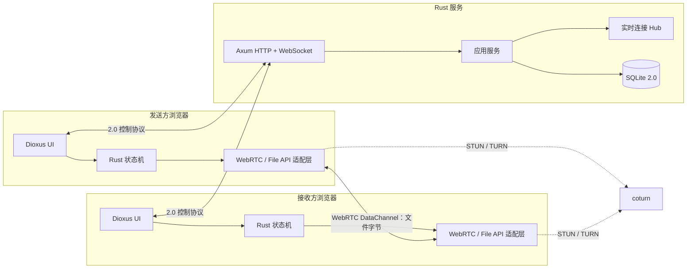

# P2P Transmission 2.0：全 Rust Greenfield 重构设计

> 状态：提案<br>
> 工作分支：`rust-dev`<br>
> 目标：保持页面视觉、交互体验和用户能力一致；不兼容 1.x 的代码、HTTP API、WebSocket 协议或数据库结构。<br>
> 实施计划：[P2P Transmission 2.0 实施计划](../plans/2026-07-15-rust-2-greenfield-plan.md)

## 1. 重新定义“迁移”

2.0 不是把 Bun/Elysia 逐文件翻译成 Rust，也不是让新后端继续服务旧前端。它是一套从零实现的新系统，1.x 只承担三种角色：

1. **视觉参考**：颜色、排版、间距、布局、响应式行为、头像、弹窗、Toast 和动效。
2. **用户行为参考**：创建房间、分享、请求加入、批准、选择接收者、发送文件、进度、取消、重试、恢复与错误反馈。
3. **验收基线**：截图、交互录像、无障碍语义、跨浏览器 E2E 和用户可见文案。

以下内容不作为兼容目标：

- React 组件结构和 TypeScript 状态实现。
- Bun、Elysia、Turbo、Vite 或当前 package workspace。
- `/v1` 路由、请求/响应 JSON 和 WebSocket 消息格式。
- SQLite v1 表结构与历史数据直接读取。
- 现有内部 ID、错误码、token 和邀请链接格式。
- 现有实现中为了兼容旧逻辑形成的轮询、全量状态保存或超大根组件。

如果未来需要保留 1.x 房间或数据，应做一次性、离线、显式的数据转换；不能为了一个尚未确认的需求污染 2.0 架构。

## 2. 产品边界

### 2.1 必须保持的体验

- 相同的暗色视觉语言、主色、层级、组件密度和响应式布局。
- 首页可以创建房间或输入房间码加入。
- 创建者可以复制房间码、分享邀请链接和查看房间剩余时间。
- 接收方连接时，头像以从小到大的进入动效出现。
- 创建者可以批准/拒绝接收方加入请求。
- 可以选择一个或多个在线接收者。
- 可以拖拽、选择或粘贴文件，并展示文件列表。
- 发送前由接收者确认；传输中展示进度、速度、ETA 和双方状态。
- 支持取消、拒绝、失败、超时、完成与再次发送。
- 页面刷新或短暂断线后给出合理恢复路径。
- 文件内容始终浏览器到浏览器传输，业务服务器不代理文件字节。
- 键盘操作、焦点管理、读屏反馈和 `prefers-reduced-motion` 行为不退化。

### 2.2 允许重新设计的内部行为

- 房间创建、审批和恢复可以使用全新协议。
- 原有 join request 轮询可改为 WebSocket 事件。
- visitor/session 可以改为 HttpOnly cookie，而不是前端持有 bearer token。
- 数据库可以重新建表并只保存必要的控制面状态。
- DataChannel 帧格式、分片、校验、背压和重试机制可以重做。
- URL、错误码和服务端事件可以版本化为 2.0 专用格式。

### 2.3 明确非目标

- 2.0 首版不做文件云存储、服务端中转或离线收件箱。
- 不承诺跨浏览器断点续传；需要协议和文件句柄能力验证后单独设计。
- 不在首版同时实现多实例、跨区域和消息队列。
- 不为了“全 Rust”重造 CSS、浏览器 API 或浏览器自动化工具。
- 不在 Web 版稳定前同时开发桌面端和移动端。

## 3. 框架选择 ADR

### 3.1 候选

| 方案 | 优势 | 代价 | 适配判断 |
| --- | --- | --- | --- |
| Dioxus Web + Axum | React 式组件心智；Rust/WASM；同一 UI 模型可扩展桌面/移动；与 Axum 有全栈集成 | WebRTC 等浏览器 API 仍需 `web-sys`；WASM 调试和编译时间高于 React | **推荐** |
| Leptos + Axum | 细粒度响应式；SSR、hydration、server functions 和渐进增强成熟 | 本项目弱 SEO、强客户端，SSR 收益有限；高频客户端状态需要额外工程纪律 | 可靠备选 |
| Yew + Axum | 成熟、React 风格、直接使用 `web-sys` | 全栈整合和跨平台路线不如 Dioxus 统一 | 备选 |
| React + Axum | WebRTC 生态和调试体验最好，重写风险最低 | 不是全 Rust 前端 | 仅作为风险回退 |

### 3.2 决策

首选 **Dioxus Web（CSR/WASM）+ Axum/Tokio**。

原因：

- 这是应用而不是内容网站，房间、信令、文件和进度状态全部发生在浏览器，CSR 比 SSR 更符合主路径。
- 现有 UI 来自 React，Dioxus 的组件/props/RSX 心智比细粒度框架更容易进行体验等价重建。
- Dioxus Web 仍然输出标准 DOM 和 CSS，不妨碍复刻当前视觉和无障碍语义。
- Dioxus 官方支持 Web、Desktop、Mobile 平台特性划分；未来可以复用纯 UI/领域部分，但不承诺 WebRTC 平台层可以原样复用。
- Axum 只承担服务端 HTTP、WebSocket、静态资源和中间件职责，不把 UI 框架与领域规则绑死。

### 3.3 先验证、后锁定

Dioxus 是架构偏好，不是信仰。完整重写前必须完成一个技术 spike：

- 两个真实浏览器通过 Dioxus/WASM 创建 `RTCPeerConnection`。
- 通过 Axum WebSocket 完成 SDP/ICE 交换。
- 建立 DataChannel，双向发送文本和至少 100 MiB 测试文件。
- 使用 `buffered_amount`/`bufferedamountlow` 实现有界发送。
- 支持拖拽、file input、Blob 下载和对象 URL 释放。
- Chrome、Firefox 和 Safari 至少完成核心链路验证。
- 无手写 JavaScript 主逻辑；允许工具生成的 WASM bootstrap 和经过隔离审计的极小 interop shim。

如果 spike 失败，先评估 Leptos/Yew 是否能解决框架层问题；如果问题来自 `web-sys`/浏览器绑定本身，则应诚实回退到 React + Rust backend，而不是用大量脆弱 JS 胶水伪装“全 Rust”。

## 4. 目标架构



核心边界：

- **服务端是控制面**：匿名会话、房间、权限、审批、presence、WebRTC signaling、TURN credential。
- **浏览器是数据面**：读取文件、分片、流控、校验、DataChannel 传输、下载落地。
- **TURN 是网络中继，不是业务文件服务**：在 NAT 限制下字节可能经过 TURN，但服务端业务逻辑看不到文件内容。
- **UI 不直接操作 Web API**：组件只发 intent 并渲染 state；平台适配层封装 `web-sys`。

## 5. Rust workspace

```text
.
├─ Cargo.toml
├─ Cargo.lock
├─ rust-toolchain.toml
├─ Dioxus.toml
├─ apps/
│  ├─ web/
│  │  ├─ Cargo.toml
│  │  ├─ assets/
│  │  │  ├─ app.css
│  │  │  ├─ fonts/
│  │  │  └─ icons/
│  │  └─ src/
│  │     ├─ app.rs
│  │     ├─ components/
│  │     ├─ pages/
│  │     ├─ state/
│  │     ├─ platform/
│  │     └─ main.rs
│  └─ server/
│     ├─ Cargo.toml
│     ├─ migrations/
│     └─ src/
│        ├─ config.rs
│        ├─ http/
│        ├─ realtime/
│        ├─ services/
│        ├─ storage/
│        ├─ telemetry.rs
│        └─ main.rs
├─ crates/
│  ├─ domain/                # 纯状态机和业务规则
│  ├─ protocol/              # HTTP/WS/DataChannel 共享帧
│  ├─ transfer/              # 分片、流控、校验、速度估算
│  ├─ browser-platform/      # web-sys/wasm-bindgen 封装
│  └─ test-support/          # clock、ID、fixture、模拟 transport
├─ e2e/                      # Playwright 作为外部浏览器验收工具
├─ deploy/
└─ docs/
```

依赖方向：

```text
domain <- protocol
domain + protocol <- transfer
domain + protocol + transfer <- browser-platform <- apps/web
domain + protocol <- apps/server
test-support -> 仅 dev/test
```

禁止 `domain` 依赖 Dioxus、Axum、Tokio、SQLite 或 `web-sys`。这样房间和传输规则可以在 native Rust 测试中高速、确定地运行。

## 6. 前端设计

### 6.1 渲染模式

- Dioxus Web CSR；首版不引入 SSR/hydration。
- Axum 同源提供静态资源、HTTP 与 WebSocket，简化 cookie、Origin、CORS 和部署。
- 首屏使用轻量静态 shell/loading，WASM 初始化后接管应用。
- 对 WASM 加载失败、浏览器不支持 WebRTC 和不安全上下文提供明确错误页。

### 6.2 组件边界

按照用户职责而不是 1.x 文件逐个翻译：

- `AppShell`：全局背景、导航、About/GitHub、Toast、错误边界。
- `HomePage`：创建房间、输入房间码、恢复提示。
- `RoomHeader`：房间码、分享、倒计时、连接状态。
- `PeerFlow`：发送者、接收者头像、连接/传输状态轨道和进入动效。
- `JoinRequestDialog`：发送方审批。
- `JoinWaiting`：接收方等待与取消。
- `TransferComposer`：拖拽、选择、粘贴、文件队列和接收者选择。
- `IncomingTransferDialog`：manifest 确认、接收进度和下载结果。
- `TransferActivity`：逐文件/逐接收者状态、速度、ETA、取消和重试。
- `ShareDialog`、`AboutDialog`、`ConfirmDialog`、`ToastViewport` 等基础层。

### 6.3 状态模型

不重建当前巨型 `App.tsx`。状态拆成可组合的 reducer/state machine：

- `SessionState`：booting、anonymous、ready、expired、fatal。
- `RoomState`：idle、creating、owner、join_pending、member、leaving、expired。
- `RealtimeState`：disconnected、connecting、attached、backoff、closed。
- `PeerState`：new、signaling、connected、degraded、failed、closed。
- `TransferState`：draft、offered、awaiting_acceptance、sending/receiving、completed、cancelled、failed。

组件持有短生命周期 UI state；领域 crate 持有会影响业务正确性的 state transition。所有异步任务带 generation/cancellation token，过期任务不能回写新会话。

### 6.4 视觉等价策略

视觉不是靠保留 React 实现，而是建立明确的 visual contract：

- 从当前 `index.css` 提取 design tokens：accent、surface、ink、border、radius、shadow、duration、easing。
- 将 Tailwind utility 组合转为语义 class，生产构建不依赖 Node/Tailwind runtime。
- 保留 Material Symbols 字体或迁移为本地 SVG sprite；二者都必须离线可用。
- 固定桌面、平板、手机三组截图基线。
- 固定关键状态截图：空房间、等待接入、头像进入、接收者列表、传输中、完成、错误、所有 dialog。
- 对动效做录像/时间窗口断言，不使用逐帧像素完全一致作为唯一判断。
- 保留最小 44px 触控目标、focus-visible、dialog focus trap、aria-live 和色彩对比。

### 6.5 动效原则

- 头像进入：`scale(0.68) + opacity(0)` 到 `scale(1) + opacity(1)`，约 360ms，使用当前强调型 easing。
- dialog、toast、文件行和状态 icon 保留短时入场，不给持续高频进度值做布局动画。
- WebRTC connecting 使用低干扰点波或脉冲；transferring 使用可识别但低成本的 dash flow。
- 只动画 transform/opacity；避免大面积 filter、box-shadow 和 layout thrashing。
- `prefers-reduced-motion: reduce` 下关闭 ripple、dash 和缩放进入，保留即时状态变化。
- Dioxus 只切换 class/data attribute，主要动效由 CSS 驱动；复杂序列才使用 Web Animations API。

### 6.6 视觉约束补充

2.0 不进行未经确认的视觉改版。默认必须直接延续 1.x 的暗色纯背景、居中窄栏、字号层级、低对比说明文字、紫色强调色、圆角、间距和克制动效。工程基线或中间里程碑也不得用新的营销页、编辑式大标题、网格纹理、装饰光效或双栏仪表盘替代现有产品气质。任何明显视觉方向变化都需要用户明确提出，不能由实现者自由发挥。

## 7. 浏览器平台适配层

`browser-platform` 是 2.0 的最高风险区域，必须窄接口封装：

```rust
trait PeerTransport {
    async fn create_offer(&self) -> Result<SessionDescription, PeerError>;
    async fn accept_signal(&self, signal: Signal) -> Result<(), PeerError>;
    async fn open_transfer(&self, peer: PeerId) -> Result<DataPipe, PeerError>;
    async fn close(&self, reason: CloseReason);
}
```

实际 Web 实现使用：

- `wasm-bindgen`、`wasm-bindgen-futures`。
- `web-sys::RtcPeerConnection`、`RtcDataChannel`、ICE/SDP 类型。
- `web-sys::File`、`Blob`、`FileReader` 或 slice/array buffer API。
- `DragEvent`、`DataTransfer`、Clipboard API、Notification API。
- `Window`、`Storage`、`Url::create_object_url_with_blob`。

平台层负责 JS/Rust 类型转换、event listener 生命周期和资源释放；UI/领域层不得散落 `JsValue`、`Closure` 和 `unchecked_into`。

每个 listener 都必须有对应 cleanup。PeerConnection、DataChannel、object URL、timer 和 animation frame 在房间退出、传输结束和组件卸载时统一释放。

## 8. 2.0 控制协议

因为不需要兼容，协议按当前产品需求重新设计。

### 8.1 HTTP

HTTP 只处理低频命令和初始 bootstrap，例如：

- `POST /api/session`：创建/恢复匿名会话，设置 HttpOnly cookie。
- `POST /api/rooms`：创建房间。
- `GET /api/rooms/{code}/bootstrap`：获得当前会话可见的房间快照。
- `POST /api/rooms/{code}/join-requests`：手动码或邀请能力发起加入。
- `POST /api/rooms/{code}/join-requests/{id}/decision`：创建者批准/拒绝。
- `POST /api/rooms/{code}/leave`：显式离开。
- `GET /api/rtc/config`：返回当前会话可用 ICE server/TURN 临时凭据。
- `GET /health/live`、`GET /health/ready`。

具体 path 在实现前可调整；重要的是命令语义、幂等键和错误模型，而不是复制旧 URL。

### 8.2 WebSocket

同源 `/realtime`，cookie 认证，首帧 attach room。协议使用 Serde tagged enum，控制消息先采用 JSON：

- Client：`AttachRoom`、`DetachRoom`、`Signal`、`Heartbeat`、`AckEvent`。
- Server：`Attached`、`RoomSnapshot`、`JoinRequested`、`JoinDecided`、`PeerOnline`、`PeerOffline`、`Signal`、`RoomExpired`、`Error`。

JSON 对控制面足够，便于浏览器抓包和故障排查；文件分片走二进制 DataChannel，不从 WebSocket 传输。

所有事件带 `event_id` 和 room revision。客户端检测 revision gap 时重新 bootstrap，不依赖“消息永不丢失”的幻想。

### 8.3 会话与邀请

- 匿名 session 使用随机高熵 ID，浏览器通过 Secure、HttpOnly、SameSite cookie 持有。
- 手动房间码只负责可输入性，不承担完整安全熵；加入仍需创建者批准和限流。
- 分享链接可以把高熵 invite capability 放在 URL fragment；fragment 不随导航自动发给服务端，由 WASM 显式提交证明。
- 数据库只保存 capability 的哈希/派生值，不保存可直接使用的明文。
- WebSocket handshake 校验 `Origin`、cookie、session 和 room membership。

## 9. DataChannel 传输协议

### 9.1 连接拓扑

- 每个发送者与每个接收者之间建立独立 `RTCPeerConnection`。
- 服务端只转发 SDP/ICE，并维护当前在线 peer 映射。
- 多接收者发送由发送方协调多个独立 peer transfer；某个接收者失败不自动终止其他接收者。

### 9.2 通道

优先建立两个 ordered/reliable channel：

- `control`：manifest、accept/reject、start、cancel、complete、error 和校验结果。
- `data`：二进制 chunk frame。

如果跨浏览器验证显示多通道兼容性问题，可退化为一个 ordered/reliable channel，但协议层仍区分 control/data frame。

### 9.3 协议帧

- 协议头包含 magic、version、frame type、transfer id 和 payload length。
- control payload 使用 Serde 可演进结构；data frame 使用紧凑二进制头 + 原始 bytes。
- manifest 包含稳定 file id、展示名称、MIME、字节数和可选 hash；不包含本地路径。
- chunk 带 file id、sequence/offset 和长度。
- 完成帧带实际字节数与增量 BLAKE3；接收端不匹配则标记失败，不提供损坏下载。
- 未知 major version 立即拒绝；未知 optional field 可以忽略。

### 9.4 背压与内存

- 发送循环观察 `RtcDataChannel.buffered_amount`。
- 达到 high watermark 时暂停读取文件；降到 low watermark 后恢复。
- chunk size 根据协商能力和跨浏览器测试选择，设置保守上限，不硬编码依赖某一浏览器最大消息值。
- UI 进度以 animation frame 节流，不为每个 chunk 触发完整 Dioxus render。
- 接收端优先使用可流式落地能力；不支持时使用 Blob/内存 fallback，并设置明确的文件大小/总内存门槛。
- 所有队列有界，超限返回用户可理解的错误，不允许浏览器标签页因 OOM 崩溃。

### 9.5 取消与失败

- 本地取消、远端取消、peer close、timeout、校验失败是不同 terminal reason。
- cancel 是幂等 control frame；本地先停止读写与释放资源，再等待有限时间的远端 ack。
- 传输结果按 receiver 独立记录，UI 汇总完成/拒绝/取消/失败/超时数量。
- 2.0 首版失败后“再次发送”重新建立 transfer，不假装支持未验证的断点续传。

## 10. 服务端架构

### 10.1 Axum transport

- route/extractor 只做协议解析、认证、body limit 和 response mapping。
- `tower-http` 提供 request id、trace、timeout、compression、静态资源和安全 header。
- WebSocket reader/writer 分离；每连接一个有界出站队列。
- 慢消费者达到容量后以明确 close reason 断开，不阻塞整个 room。

### 10.2 应用服务

- `SessionService`：匿名会话与过期。
- `RoomService`：房间创建、过期、membership 和 revision。
- `AccessService`：join request、邀请能力和批准/拒绝。
- `PresenceService`：连接 attach/detach 和在线状态。
- `SignalService`：验证成员关系后路由 SDP/ICE。
- `TurnService`：生成短期 credential。
- `MaintenanceService`：过期 session/room/request 清理。

领域命令与事件属于 `domain` crate；服务层负责事务和副作用顺序。

### 10.3 Realtime hub

一个进程内 hub/actor 持有：

- connection id → bounded sender。
- session/room → connection ids。
- peer id → 当前有效 connection generation。
- room revision 的在线快照。

所有 register/unregister/send/broadcast 操作串行化或通过等价的并发安全设计实现。旧连接退出不能误删后来建立的新连接。

## 11. 存储

### 11.1 选择

2.0 首版继续使用 SQLite，但采用全新 schema 和 `sqlx` migrations：

- 当前部署是单实例，SQLite 足够且运维成本低。
- 房间和会话状态规模小，文件字节不入库。
- Rust 服务可以使用 connection pool 和事务，而不需要全量内存快照回写。

建议表：

- `sessions`
- `rooms`
- `room_members`
- `join_requests`
- `invite_capabilities`
- `schema_migrations`

实时 socket、SDP、ICE、DataChannel 状态和文件清单默认不持久化。

### 11.2 数据原则

- 外键开启，所有时间存 UTC epoch integer。
- 房间/请求状态转移在事务中完成，并递增 room revision。
- mutation 使用条件更新保护并发，例如 `WHERE revision = ?`。
- WAL、busy timeout 和 checkpoint 用真实负载验证。
- migration 只向前；部署前备份，失败不启动 readiness。
- session、room、request 有索引化 expires_at，维护任务小批量清理。
- 新 schema 不保证 Bun 可读；回滚是回到完整 1.x 部署及其独立数据库，而不是让 Bun 打开 2.0 数据库。

### 11.3 1.x 到 2.0

推荐不迁移临时房间和匿名会话。发布 2.0 时：

- 1.x 在独立路径保留短观察期。
- 2.0 使用新的数据库文件/volume。
- 已打开的 1.x 房间在自然过期前继续由 1.x 服务处理，或在发布窗口明确结束。
- 不把匿名临时数据转换成长期数据。

## 12. 安全与隐私

- 生产只允许 HTTPS/WSS；WebRTC 与 File/Clipboard API 依赖安全上下文。
- cookie：Secure、HttpOnly、SameSite；所有 mutation 与 WS 校验 Origin。
- 房间码、join、session 创建和 signaling 都有限流与容量限制。
- SDP/ICE 不写数据库、不写普通日志；日志只记消息类型、大小和安全摘要。
- 不记录文件内容、本地路径、完整文件名清单或用户剪贴板内容。
- 文件名输出做文本转义；下载不使用服务器提供的路径。
- CSP、frame-ancestors、nosniff、referrer policy 和 permissions policy 明确配置。
- TURN credential 短期有效，secret 仅通过服务端配置注入。
- Rust/WASM panic 映射为受控错误边界；生产不向用户暴露内部 backtrace。
- 依赖执行 `cargo audit`/`cargo deny`，release 产出 SBOM。

## 13. 可观察性

### 服务端

- `tracing` JSON log：request id、route、status、latency、error code、room/session 安全摘要。
- 指标：HTTP 延迟/错误、WS 连接、关闭原因、hub queue、SQLite transaction、join 状态、room 数量。
- `/health/live` 只表示进程活着；`/health/ready` 表示 DB、migration、hub 和维护任务可工作。
- SIGTERM 先停止新请求，再关闭 WS 和后台任务，最后 flush DB/telemetry。

### 浏览器

- 默认只在本地 console 输出开发日志。
- 若未来接入错误上报，必须先做敏感字段清洗，并给出隐私说明。
- 为每次 peer/transfer 分配本地 correlation id，方便把 UI 错误与服务端 signaling 日志关联。

## 14. 测试策略

### 14.1 Native Rust

- 领域状态机单元测试和 table-driven transition tests。
- property tests：随机命令序列不破坏不变量、不 panic。
- protocol encode/decode golden fixtures。
- transfer chunk、hash、速度、ETA 和 backpressure 模拟测试。
- Axum route、SQLite repository 和 hub integration tests。

### 14.2 WASM/browser

- `wasm-bindgen-test` 验证平台适配层和资源 cleanup。
- Dioxus 组件测试关注语义 DOM、键盘、aria 和状态渲染。
- 不把所有领域规则塞进慢速浏览器测试。

### 14.3 产品等价 E2E

保留 Playwright 作为测试工具，即使生产应用是全 Rust。它不进入用户 bundle，而且跨浏览器、trace、录像和无障碍验证的价值高于语言纯度。

- 对 1.x 录制 visual/behavior baseline。
- 对 2.0 验证同一用户目标，不要求内部网络请求一致。
- 覆盖 Chromium、Firefox、WebKit。
- 使用两个独立 browser context 表示发送者和接收者。
- 核心场景必须走真实 Axum WebSocket 和真实 WebRTC；只有单元测试才 mock。
- 截图比较设置合理阈值，字体和 OS 环境固定。
- 网络故障、慢接收者、刷新、取消和 TURN relay 单独建 suite。

## 15. 性能预算

2.0 不只比较后端吞吐，还要约束 WebAssembly 用户体验：

- 压缩后的 WASM 初始包设置预算，并按实际基线锁定；超预算必须解释。
- 首屏 shell 立即可见，WASM 下载/编译期间有可访问 loading。
- 领域/协议 crate 关闭不需要的 features，`web-sys` 只开启所需 bindings。
- release 启用适合 WASM 的 LTO/opt-level，并用 `wasm-opt` 验证收益。
- 进度事件按 animation frame 合并；大文件传输期间主线程保持响应。
- 文件读取、hash 和发送流水线有界；不把整个大文件复制多份。
- Axum/SQLite 在 2C2G 目标机做 soak，不能只在开发机跑 benchmark。

## 16. 构建与部署

### 16.1 开发

- `dx serve --web` 构建 Dioxus Web。
- `cargo run -p p2p-server` 启动 Axum，开发代理/同源配置由脚本封装。
- 根 Python 脚本统一启动 server、web、coturn 和测试 fixture，避免 shell 编码差异。

### 16.2 生产

- CI 构建 WASM/static assets 和 Linux Rust server release binary。
- 最终镜像只包含 server、静态资源、CA 和必要系统库。
- 生产主机拉取按 commit SHA 标记的镜像，不在 2C2G 主机编译。
- Axum 可以直接服务静态资源；Nginx 继续负责 TLS、压缩策略和入口限流。
- SQLite 2.0 使用独立 volume；coturn 独立进程/容器。
- 1.x 和 2.0 首次上线使用独立域名或明确路由，避免共用数据库和 cookie namespace。

## 17. 风险

| 风险 | 影响 | 控制措施 |
| --- | --- | --- |
| Rust/WASM 的 WebRTC 绑定繁琐 | 延期、资源泄漏、浏览器差异 | 第一阶段 spike；窄平台层；跨浏览器真实测试 |
| Dioxus 生态比 React 小 | 部分 UI/测试能力需自建 | 优先 Web 标准与 CSS；不依赖冷门组件库；保留框架回退点 |
| WASM 包过大、冷启动慢 | 首次体验变差 | CSR shell、feature pruning、wasm-opt、bundle budget |
| 大文件在浏览器内存复制 | OOM、页面卡顿 | 分片流水线、背压、流式落地能力探测、大小门槛 |
| Safari DataChannel 行为差异 | 核心功能不可用 | spike 即覆盖 WebKit；保守 chunk；TURN/ICE 实测 |
| “视觉一致”缺少客观标准 | 无限返工 | 状态矩阵、截图基线、交互录像和验收清单 |
| 全量重写失去持续可用版本 | 长分支漂移 | 按 vertical slice 交付；1.x 冻结协议但继续修 P0/P1 |
| 新协议和新库同时变化过多 | 难定位问题 | 先单 peer/单文件 happy path，再逐步加入审批、多接收者和恢复 |

## 18. 关键决策摘要

1. 2.0 是体验等价的 greenfield rewrite，不是兼容迁移。
2. 应用生产代码以 Rust 为主：Dioxus Web + Axum + shared Rust crates。
3. CSS、HTML、浏览器 Web API 和 Playwright 仍按 Web 标准使用，不追求形式上的语言纯度。
4. 前端使用 CSR；SSR 不是首版目标。
5. 文件字节只走 WebRTC DataChannel，Axum 只做控制面。
6. 新协议由 Rust shared crate 直接共享，控制面 JSON、DataChannel 二进制。
7. SQLite 使用全新 2.0 schema；不兼容 1.x 数据库。
8. 第一里程碑不是重写页面，而是证明 Dioxus/WASM 下 WebRTC、大文件、背压和跨浏览器可行。
9. UI 通过视觉/行为基线验收，不通过内部实现相似度验收。
10. Dioxus spike 不通过时允许更换 Rust UI 框架；浏览器绑定层仍不可靠时允许 React + Rust backend 的诚实回退。

## 19. 参考

- [Dioxus Fullstack](https://dioxuslabs.com/learn/0.7/essentials/fullstack/)
- [Dioxus 平台支持](https://dioxuslabs.com/learn/0.7/guides/platforms/)
- [Dioxus UI](https://dioxuslabs.com/learn/0.7/essentials/ui/)
- [Axum](https://docs.rs/axum/latest/axum/)
- [Leptos 与 Axum 集成](https://book.leptos.dev/server/26_extractors.html)
- [Leptos web-sys 说明](https://book.leptos.dev/web_sys.html)
- [Yew web-sys 说明](https://yew.rs/docs/concepts/basic-web-technologies/web-sys)
